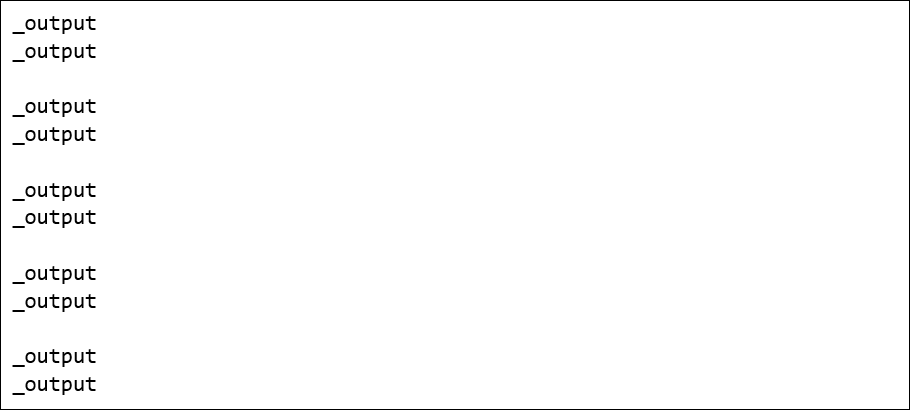

# Iskierka

Iskierka is a declarative programming language whose purpose is to associate natural language text with programming language code.

```
#output
do something
print('hello, world');
```

## IskierkaGen

IskierkaGen establishes an infinite source of synthetic data for AI based on rules from some Iskierka codebase.
It constructs pairs of random strings (natural language text and programming language code) that are correlated.
See below the animated process of Perun2 code generation along with text in English.



Directory IskierkaGen contains a header-only C++ implementation of IskierkaGen. It automatically supports both Win32 API and POSIX.

## How does it work?

This is a context-free rewriting system similar to Lindenmayer system ([link](https://en.wikipedia.org/wiki/L-system)). We define production rules and at runtime they are applied to variables until only constants are left. 

There are several differences between Iskierka and L-systems. The most notable one is that we produce two strings at once and variables are treated as inseparable pairs of strings. The system is stochastic as we can assign multiple production rules to one variable. If the same variable appears more than once in a production rule, then randomization is performed only once locally and all variable instances get the same value. Unlike the classic Lindenmayer system, we have to use the depth-first algorithm for variable evaluation here.

## Codebases

Iskierka has been initially designed by WojFil Games for code generation of the Perun2 programming language.
Go [here](https://github.com/wojfil/perun2-iskierka) to see an example Iskierka codebase prepared for Perun2.

## Other links

[Right here](TUTORIAL.md) you can find a quick tutorial.
Iskierka has some interesting and unique [design patterns](TERMINOLOGY.md).

## How to run?

In code below we use the header-only C++ implementation of IskierkaGen.
Make sure to put 'iskierka.h' in the same directory as 'main.cpp'.
After compilation, you should prepare an Iskierka codebase (a directory 'data') in the location with the compiled program.

```
#include "iskierka.h"

int main(void)
{
    // 'data' is the name of the relative directory with *.iski codes
    iskierka::IskierkaGen iskierka("data");

    if (! iskierka.isParsed())
    {
        return 1;
    }

    std::string natural;
    std::string programming;

    for (int i = 0; i < 10; i++)
    {
        if (iskierka.next(natural, programming))
        {
            std::cout << natural     << std::endl;
            std::cout << programming << std::endl;
            std::cout << std::endl;
        }
        else
        {
            std::cout << "IskierkaGen error: out of memory" << std::endl;
            std::cout << std::endl;
        }
    }

    return 0;
}
```
